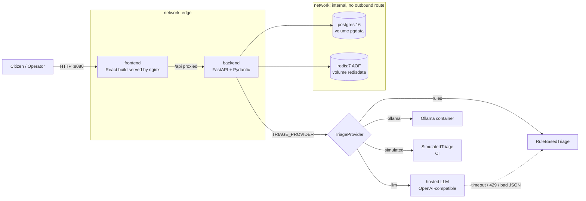

# CivicPulse

[](https://github.com/Abdullah-SE-bit/civicpulse/actions/workflows/ci.yml)

End-to-end municipal complaint intake, triage and operations platform. A citizen submits a free-text complaint; the backend triages it (category, priority, one-line summary) through a replaceable `TriageProvider`, stores it in PostgreSQL, and an operations dashboard lists it with cached aggregate statistics.

The engineering point is that the *reader* is replaceable: today keyword rules, tomorrow a hosted LLM or a local model. The system around it validates the output, times out, retries once, falls back to rules, caches by content hash and never returns a 500 because a third party was slow.

## Status (what is and is not verified)
| Area | State |
|---|---|
| Backend tests, lint, types; frontend tests, lint, types; kustomize + kubeconform on the prod overlay | pass in CI on a real runner (run 36053169219, `dev`). Check the badge for the current state |
| Image build + Trivy scan in CI | pass (run 36053169219). They failed twice first: a non-existent Trivy action tag, then 44 + 38 HIGH/CRITICAL base-image findings, fixed by newer base tags and OS package upgrades |
| Docker Compose stack, network isolation, persistence, failure and SIGTERM behaviour | **run on a GitHub runner** (not a laptop): 46 checks passed. See [docs/evidence/compose-run.md](docs/evidence/compose-run.md). The CI `integration` job also passes |
| Kubernetes: probes, StatefulSet persistence, Redis-down behaviour, HPA scale-out under k6 load, VPA recommendation | **run on kind inside a GitHub runner** (shared 4 vCPU, not a laptop or a real cluster): 22 checks passed; HPA scaled 2 -> 10 replicas under 120 req/s; charts and the `kubectl get hpa -w` capture are committed. See [docs/evidence/k8s-run.md](docs/evidence/k8s-run.md). The rollback commands and a rolling update under load were also run on kind ([docs/evidence/rollout-run.md](docs/evidence/rollout-run.md)): rollback worked, but one of six runs saw 30 failed requests of 7,501, cause unknown, so zero downtime is not established |
| cd.yml | **ran on `main`** (run 36102402634): test, then SHA-tagged images pushed to GHCR with SBOMs, then deployed by SHA to an ephemeral kind cluster with a passing Ingress smoke test. See [docs/evidence/cd-run.md](docs/evidence/cd-run.md). GHCR package visibility not verified. `release.yml` has never run |

## Architecture

- The frontend is on `edge` only, so it has no route to the database. The backend is the only service on both networks and therefore the only one that can reach a hosted LLM.
- Backend layers, one direction only: `routes/` (HTTP) -> `services/` (business rules, state machine, stats) -> `repositories/` (all SQL) and `providers/` (LLM, Redis).
- Redis does three jobs: `/api/stats` cache (30 s TTL, invalidated on write), a fixed-window rate limiter on `POST /api/complaints` shared across replicas, and the 24 h triage-result cache.
- Schema comes only from Alembic migrations.

## Quickstart (Docker Compose)
The Compose stack is exercised in CI on every push to `dev`; a manual run from a fresh clone on a laptop has not been done.
```bash
git clone https://github.com/Abdullah-SE-bit/civicpulse.git && cd civicpulse
cp .env.example .env        # placeholders; the default provider needs no key
docker compose up --build
```
Open http://localhost:8080 (UI) and http://localhost:8000/docs (API docs, dev stack only). The backend runs migrations and seeds 30+ sample complaints on first start; the seed is idempotent.

## Configuration
Everything comes from environment variables (see `.env.example`); nothing secret is committed.

| Variable | Meaning |
|---|---|
| `POSTGRES_DB`, `POSTGRES_USER`, `POSTGRES_PASSWORD` | database credentials; `.env` is gitignored |
| `DATABASE_URL`, `REDIS_URL` | must use the service names `postgres` and `redis` in Compose/Kubernetes, not `localhost` |
| `TRIAGE_PROVIDER` | `simulated` (code default), `rules`, `ollama`, `llm` |
| `LLM_API_KEY`, `LLM_BASE_URL`, `LLM_MODEL`, `LLM_VENDOR` | for `llm` (`groq` or `gemini`). With an empty key the backend serves `rules` and logs a warning |
| `OLLAMA_BASE_URL`, `OLLAMA_MODEL` | for `ollama` (`--profile ollama`) |
| `RATE_LIMIT_PER_MINUTE` | per-client limit on `POST /api/complaints` (default 20) |
| `RUN_MIGRATIONS`, `SEED_ON_START` | entrypoint switches, both default `true`; Kubernetes runs them once in an init container instead |
| `IMAGE_TAG` | image tag for `compose.prod.yaml` (a commit SHA) |

## Triage providers
| `TRIAGE_PROVIDER` | Recorded `triaged_by` | Notes |
|---|---|---|
| `llm` | `llm:groq` / `llm:gemini` | sends location + complaint text to a third party: read [ADR 0004](docs/adr/0004-pii-and-data-governance.md) first |
| `ollama` | `llm:ollama` | fully local |
| `rules` | `rules` | deterministic keywords, always available |
| `simulated` | `simulated` | deterministic, for tests, supports failure injection |

Any provider failure becomes `rules:fallback` and the request still returns 201. Details: [docs/TRIAGE.md](docs/TRIAGE.md).

## API
| Method | Path | Behaviour |
|---|---|---|
| POST | `/api/complaints` | validate, triage, persist: 201; 400 with field errors; 429 with `Retry-After` |
| GET | `/api/complaints/{id}` | 200 / 404 |
| GET | `/api/complaints` | filters `category`, `priority`, `status`; `page`, `page_size` (max 100); returns `items`, `total` |
| PATCH | `/api/complaints/{id}/status` | state machine: open -> in_progress -> resolved, open/in_progress -> rejected; anything else 409 naming the transition |
| GET | `/api/stats` | counts by category and priority; header `X-Cache: HIT\|MISS` |
| GET | `/api/meta/providers` | active provider, last 20 triage outcomes, cache tally |
| GET | `/health` | liveness, does not touch the database |
| GET | `/ready` | 200 only if Postgres and Redis answer, else 503 naming which |
| GET | `/metrics` | Prometheus text |

## Testing
```bash
cd backend  && pip install -e ".[dev]" && ruff check . && mypy app && pytest --cov=app
cd frontend && npm ci && npm run lint && npx tsc --noEmit && npm test
scripts/integration.sh      # against a running Compose stack
```
Backend tests use `SimulatedTriage`, `fakeredis` and mocked HTTP, so none needs a network or a live LLM.

## Kubernetes
Kustomize: `k8s/base` plus `k8s/overlays/{dev,prod}`, everything in namespace `civicpulse`. Backend and frontend Deployments (2 replicas, `maxSurge 1` / `maxUnavailable 0`), Postgres as a StatefulSet with a `volumeClaimTemplate`, Redis Deployment + PVC (AOF), four ClusterIP Services, one Ingress (`/` to frontend, `/api` to backend), ConfigMap, backend HPA (2-10, CPU 60%) and PDB, three probes on the backend. The Secret is *not* in the overlays: `k8s/secret.example.yaml` holds placeholders and the real one is created out of band. An optional VPA in recommendation-only mode is in `k8s/optional/vpa.yaml`. Procedures: [docs/RUNBOOK.md](docs/RUNBOOK.md).

## CI/CD
- `ci.yml` (PR to `main`, push to `dev`): lint and type-check, backend and frontend tests, image builds (never pushed) with Trivy, kustomize|kubeconform, Compose integration test.
- `cd.yml` (push to `main`): test, then build and push images tagged with the commit SHA (plus `latest`) with an SBOM, then deploy the prod overlay by SHA to an ephemeral kind cluster and smoke-test the Ingress. Every publishing and deploying job uses `needs:`. `latest` is never deployed ([ADR 0003](docs/adr/0003-deploy-by-sha.md)).
- `release.yml` (tag `v*`): semver-tagged images and generated release notes.

## Rollback
`kubectl -n civicpulse rollout undo deployment/backend` for speed; re-apply the overlay with a previous SHA for an auditable record. See [docs/ROLLBACK.md](docs/ROLLBACK.md).

## Documentation
[RUNBOOK](docs/RUNBOOK.md) | [TRIAGE](docs/TRIAGE.md) | [ENGINEERING-NOTES](docs/ENGINEERING-NOTES.md) | [ADRs](docs/adr/) | [AI-USAGE](docs/AI-USAGE.md)

## Workflow
- `main`: stable, deployable. `dev`: integration. Short-lived `feature/*`, `fix/*`, `docs/*`, `test/*` branches.
- Everything enters `dev` through a pull request linked to an Issue and reviewed by the other collaborator; `dev` is merged to `main` via PR when coherent.
- Conventional commits: `feat:`, `fix:`, `docs:`, `test:`, `refactor:`, `chore:`, `ci:`, `build:`.

## Team
- Abdullah-SE-bit: backend, data, AI layer, architecture
- rayyanhasan899: frontend, containers, Kubernetes, CI, documentation

AI assistance is disclosed in [docs/AI-USAGE.md](docs/AI-USAGE.md).

## License
MIT
